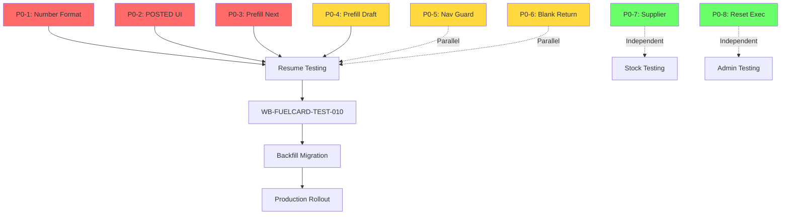

# QA-BLOCKERS-001: Critical Issues Summary

**Status:** 🔴 BLOCKS FUEL CARD ROLLOUT  
**Discovered:** 2025-12-24 during WB-FUELCARD-TEST-010  
**Impact:** Manual testing cannot proceed, backfill migration blocked  

---

## Overview

Manual testing revealed **8 P0 system defects** that make the application unusable. These are not fuel-card-specific but fundamental waybill lifecycle, UX, and data integrity issues.

**Priority Order:** P0-1 → P0-2 → P0-3 (critical path for waybill testing)

---

## Blockers List

### 🔴 P0-1: WB-NUM-001 - Waybill Number Format
**Problem:** UI shows "ЧБ 1" instead of "ЧБ 000001"  
**Root Cause:** Backend stores `blank.number` (integer) instead of `blank.formattedNumber`  
**Fix:** `waybillService.createWaybill` should use `formattedNumber`

---

### 🔴 P0-2: WB-POSTED-UI-002 - Fields Cleared After POST
**Problem:** Date, validFrom, validTo, routes disappear after POSTED  
**Root Cause:** Frontend does partial state merge after status update  
**Fix:** Reload full waybill via `GET /waybills/:id` after POST

---

### 🔴 P0-3: WB-PREFILL-NEXT-003 - Next WB From Last POSTED
**Problem:** New waybill doesn't inherit odometer/fuel from previous POSTED  
**Root Cause:** Prefill uses vehicle master data, not closed history  
**Fix:** `getWaybillPrefillData` should query last POSTED waybill

```typescript
// Current: vehicle.currentOdometer (wrong)
// Fixed: lastPostedWaybill.odometerEnd
```

---

### 🟡 P0-4: WB-PREFILL-DRAFT-004 - Prefill After DRAFT
**Problem:** Next waybill doesn't inherit dispatcher/controller  
**Root Cause:** Prefill may not return all responsible party fields  
**Fix:** Verify `dispatcherEmployeeId`, `controllerEmployeeId` in prefill

---

### 🟡 P0-5: UX-DOC-GUARD-005 - Navigation Guard
**Problem:** Data loss when navigating away without saving  
**Root Cause:** No dirty state tracking + confirmation modal  
**Fix:** Create `useNavigationGuard` hook + "Save & Close" button

**User Decision Required:**
- Option A: "Сохранить" auto-closes document
- Option B: Two buttons ("Сохранить" + "Сохранить и закрыть")

---

### 🟡 P0-6: BSO-RETURN-006 - Blank Return on Deletion
**Problem:** Deleting POSTED waybill doesn't return blank to pool  
**Root Cause:** No cancel/void logic for POSTED status  
**Fix:** Add `CANCELLED` status + ledger void transaction

**User Decision Required:**
- Option A: POSTED deletable with void (complex)
- Option B: POSTED cancellable only (CANCELLED status)
- Option C: POSTED immutable (delete disabled)

**Recommended:** Option B (CANCELLED status)

---

### 🟢 P0-7: STOCK-INCOME-SUPPLIER-007 - Supplier Field
**Problem:** No supplier field in stock income operations  
**Root Cause:** Missing field in stock movement form  
**Fix (Quick):** Use `externalRef` for supplier name  
**Fix (Full):** Create `Supplier` entity (P1)

**User Decision Required:**
- Quick fix: `externalRef = "ООО Ромашка, накл. №12345"`
- Full solution: New `Supplier` model with relations

---

### 🟢 P0-8: FUEL-RESET-008 - Fuel Card Reset Execution
**Problem:** No way to execute fuel card reset from UI  
**Root Cause:** Missing "Run Now" action in reset rules  
**Fix:** Add `POST /api/admin/fuel/resets/run` endpoint + UI button

---

## Dependencies Graph



**Critical Path:** P0-1 + P0-2 + P0-3 must be fixed before any waybill testing.

---

## Effort Estimate

| ID | Item | Effort | Risk |
|----|------|--------|------|
| P0-1 | Number Format | 1h | Low |
| P0-2 | POSTED UI | 2h | Low |
| P0-3 | Prefill Next | 3h | Medium |
| P0-4 | Prefill Draft | 1h | Low |
| P0-5 | Nav Guard | 4h | Medium |
| P0-6 | Blank Return | 6h | High |
| P0-7 | Supplier | 2h (quick) / 8h (full) | Low |
| P0-8 | Reset Exec | 3h | Low |

**Total (Critical Path):** 6 hours  
**Total (All Items):** 22-28 hours (2-3 days)

---

## Recommended Execution Order

### Day 1 (Critical Path)
1. **Morning:** P0-1 (1h) + P0-2 (2h) → Deploy → Test
2. **Afternoon:** P0-3 (3h) → Deploy → Test

### Day 2 (UX & Integrity)
3. P0-4 (1h)
4. P0-5 (4h) - requires user decision
5. P0-6 (6h) - requires user decision

### Day 3 (Features)
6. P0-7 (2h quick fix)
7. P0-8 (3h)
8. **End of Day:** Resume WB-FUELCARD-TEST-010

---

## User Decisions Required

Before proceeding with implementation, please confirm:

1. **POSTED Deletion Policy (P0-6):**  
   ☐ Option A: Deletable with void  
   ☐ Option B: Cancellable only (recommended)  
   ☐ Option C: Immutable  

2. **Supplier Model (P0-7):**  
   ☐ Quick: Use `externalRef`  
   ☐ Full: Create `Supplier` entity  

3. **Save & Close UX (P0-5):**  
   ☐ Option A: "Сохранить" auto-closes  
   ☐ Option B: Two buttons  

---

## Next Steps

1. **User:** Review decisions in implementation plan
2. **Agent:** Implement P0-1, P0-2, P0-3 (critical path)
3. **User:** Re-test waybill creation/posting
4. **Agent:** Implement remaining blockers
5. **User:** Complete WB-FUELCARD-TEST-010
6. **Agent:** Execute backfill migration

---

## Files Created

- [`task.md`](file:///C:/Users/User/.gemini/antigravity/brain/49901061-730c-4a4a-950d-297befd75ff2/task.md) - Updated task checklist
- [`implementation_plan.md`](file:///C:/Users/User/.gemini/antigravity/brain/49901061-730c-4a4a-950d-297befd75ff2/implementation_plan.md) - Detailed implementation plan
- This summary document

---

**Created:** 2025-12-24T16:22  
**Last Updated:** 2025-12-24T16:24
